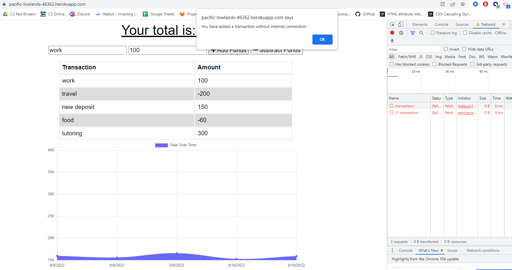
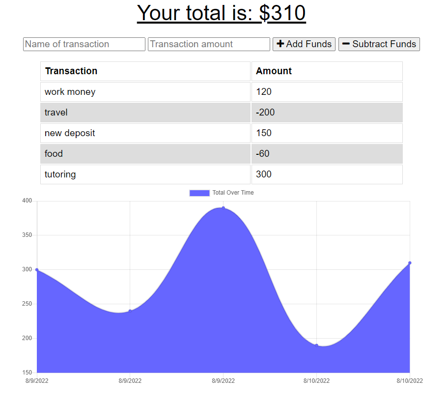
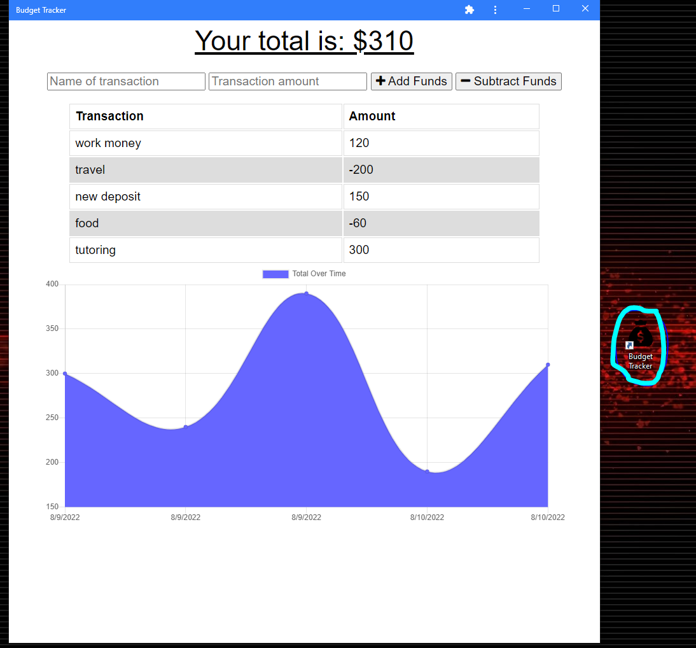

# PWA Budget Tracker

For this project, I was tasked with the implementation of offline functionality to an existing application through the usage of IndexedDB and Service Workers.  Additionally, I was responsible for converting this application into a deployable Progressive Web Application, or PWA.  This latter part was achieved with the creation of a Web Manifest.

## Description

This application is a budget tracker that allows users to add deposits and withdrawals from their budget.  By including offline functionality, I have enabled users to continue making changes to their budget total even when internet connection does not exist.  By turning the app into a PWA, users can now install the application directly onto their desktop or phone homepage.

Screenshot of app while offline:

Screenshot while online:

Screenshot of PWA with icon on desktop:

## Installation/Usage

In order to use this application, click on the following link: https://pacific-lowlands-46362.herokuapp.com/

In order to use the application as a PWA, you will need to first open the link and then click on the arrow (or plus) symbol on the right side of the URL bar.  That button should allow you to install the application directly onto your homepage.

## Reflection